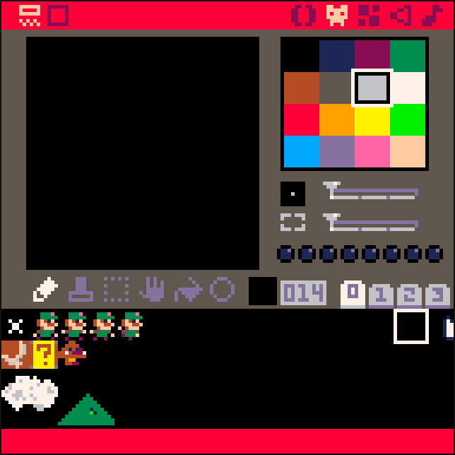

# Player Animation

## Desired outcomes from this lesson

The purpose of ths lesson is to ensure each participant has a basic understanding of how to animate a sprite.

## Draw new sprites



## Update our Init, Update, Draw Functions

```lua
-- player animation
-- by ben

----------
-- init --
----------

function _init()

    player={
        sp=1,
        x=59,
        y=59,
        w=8,
        h=8,
        flp=false,
        acc=1,
        anim=0,
        running=false,
        jumping=false,
        sliding=false,
        falling=false,
        landed=false
    }

    gravity=0.3

end


------------
-- update --
------------

function _update()

    player_update()
    
    player_animate()
    
    keep_plr_on_screen()

end

----------
-- draw --
----------

function _draw()

    cls(12) -- clear screen

    map(0,0)  -- where the game starts
    
    spr(player.sp,player.x,player.y,1,1,player.flp)  -- draw the player

end
```

## Update Player Functions

```lua
----------------------
-- player functions --
----------------------

-------------------
-- player update --
-------------------

function player_update()

	-- physics
	player.y+=gravity

	-- move left
	if btn(0) then
		player.x-=player.acc
		player.flp=true
		player.running=true
	end

	-- move right
	if btn(1) then
		player.x+=player.acc
		player.flp=false
		player.funning=true
	end

	-- idle
	if player.running
		and not btn(0)
		and not btn(1) then
			player.running=false
	end

	-- jump
	if btn(2) then 
		player.y-=player.acc
	end

end

---------------------------
-- keep player on screen --
---------------------------

function keep_plr_on_screen()

	-- stop at bottom of screen
	if player.y >= 111 then
		player.y = 111
	end

	-- stop at top of screen
	if player.y <= 0 then
		player.y=0
	end

	-- reset on right of screen
	if player.x > 127 then
		player.x=0
	end

	-- reset on left of screen
	if player.x <= -8 then
		player.x= 127
	end

end

--------------------
-- player animate --
--------------------

function player_animate()

	-- jumping (tba)
	if player.jumping then
		player.sp=127

	-- falling (tba)
	elseif player.falling then 
		player.sp=8

	-- sliding
	elseif player.sliding then
		player.sp=9

	-- running
	elseif player.running then
		if time()-player.anim >.1 then
			player.anim=time() 
			player.sp+=1
			if player.sp>4 then
				player.sp=3
			end
		end

	-- idle
	else
		if time()-player.anim > .3 then
			player.anim=time()
			player.sp+=1
			if player.sp > 2 then
				player.sp=1
			end
		end
	end
end 
```


## Bookmarks

1. [Starting Point From Last Class](https://www.pico-8-edu.com/?c=AHB4YQnSAvHrweIDXH-zSxz_Bln0Aue-QPMKzRtUO544vi2TtqqC3MCuCZui7Kzk6ur_Z8juVw2pznfPJaeEQRQEmoLXvYWZDPMOO81RF7n5KZrLrnM7dty_p4jOsz6ewexa2YurZi3KtyyPZibQFc9WoGLUneZ4DW5tBWvFMyiH1xjvEE0OGP-M_-AdjH8aIjH_GfRpM1D4zlavMeeuOu-eIt1c2tg478I2yPu_UVSXptrIRpPHnao6ddWpEKasTtPDM8YRcl4VcvN_nyIJsqYYmWiG42RmqgqDandXklDjnXmVD2q8-3KPxmsYp2GouRJFaRfuqopZb6zpy5nVou3sUy_2bRGNRE2zFtdRNNBVYdLoFitDJLUE3VLT905cNepYMlsUrhWAkBQTKVIUMZ6Q8aWr_urzOtZ07iFYG2qu2_tQaadY_6OYqR-_SuJHq92FSGU4EUaDQ4lSfuLowkWxSJXglbnJnZ2xZHbIUHlSTUeDS3t7SiqNrrZe6m7vREUM81s3J1sbrX2r_T2ijetujSr9cTX54JAA_dYEyO8ZAfL-0MaHAvn-adonmtAq79bGEUEfFEHgA9WNZGBnQBjpbaRwnFc5ny8kmQ7VD3uIn1e1V1ZEfVwm6wJOCJFg15US7O_YBPsh_CWxX6cfqTinPG1YKmnK0--SqNblVvd-1SbX0mYvHlVJaKKg2IuSXqo3DoQltXabyalkJAgU5twnUa-CXcZUipfCqE3kxX-e2iRr4uL-Amnxa2mrL2pRFCEq8fJ-q1lapCOXapfflbz4-_jsqIv-1S6oV9XF-2kPKKOrCITf-7BIeFAtUOr9h8b76C78EXASyAfPBqq3y5npRp7JBcYqHJr6ANpAyfA3kww-4ThQZfydl_4TGn9kPpXlZY56a0TIIJXNFUPo99Tn6-2kcmHWdxyvNaK0avZqmupQJftbD2Hd1ZI-kvZQScdGKUxYtNu7C6LlvzPR8v---2tEtPyXzDlEy9kFjvUF&g=wHjOw-w1zBw-wrHQHwAEPEBPw-wtXwBEfUPw-wsXwCEvw-wsHQHwAVTFw-wzPAjAPw-wzCgC)
2. [Final Code](https://www.pico-8-edu.com/?c=AHB4YQloAtPrweIDXH-zSxz_Bln0Aue-QPMKzRtUO544vi2TtqqC3MCuCZui7Kzk6ur_Z8juVw2pznfPJaeEQRQEmoLXvYWZDPMOO81RF7n5KZrLrnM7dty_p4jOsz6ewexa2YurZi3KtyyPZibQFZeGSXaa-TE4NRWMFc_gGu53iCZ72191Hr6D7S87JLa-gjxt_sJ1pnqNNW-VefcW6eTQxsZ5F7ZB3veNirp01EY2mjzulNSppU6FMDV1mh6eMb6k25y-pyiCarUYmWiG42RmqQqDanZWjlDTnXmV72m6-3KPpmsYp_HoiakAhBXiMt3VFTPfXLNQDs0WZWeffrJti2gmapq9uI6iga4Kk0a1HEHe5KJzW1HUO3HWqHPJRlG4VvJBUkymSFHEeFLGl66qq8-rmFO2h0RtqLhur0OjnVLtj0amfvgrgh_ldothaexMdMniUqKNnzg6cVIqUiV4ZW9zZ2ctmR0yVJ5U29Hi0t6ekkqjpK2Xut07UQPD-FbKydZWa99bD9fb_lTq40rqwSH58Y3Jj98r8uP-oYsP-fH-UbOOFnTKOzVxhUFcoLVR9DO5INLbCOAYy-d8IaH02EPyvDq9WaA5PidNBEQQIrquVdH1d0t0-RD4ktWv0w9vCHIJ0nahdqYg-S8lfuv5v_qSa2Wz2Y6qIzRRUMxFSS-Nq6rOsplcSkaCQNr8LbylCn9oi9pEWPzXrU0yJiv_J5CaP5am_qKWQZGbEiz-s5qlRTpxqf79Kyz_W0VHV-yfXsHIqq74H80Bcff-JIzwAFignPsPQAh-iC08S8L3ItNAxX-4sl3pM6mgWlVDJx9oGigX-mVy4RfgBqqLf-MyvALjFOwU1oc18q0Z4YJW-lf6oF-VlJ-zk4qFGZ9xvNYMWFKcPE12qOj_qX2w7knpXh_pIW6kUoRFvL07IVL_MxMp----34pI_Q9JU5HyuckR&g=wHjOwAjOwAjOwAjOw-wdzBgzBgzBgzBw-wTHQHwAEPEBPgEPEBPgEPEBPgEPEBPw-wVXwBEfUPQEfUPQEfUPQEfUPw-wUXwCEvwAEvwAEvQPAEvw-wUHQHwAVTFQPVTFPAPVTFgVTFw-wbPAjAPgjwBjAPQCjPw-wcCgCgCgCgCQCwCCw-wU0BPUN6CNgUw-wk0BPGUK0AKEQ0Aw-wj0BPGUKEaEKEAUBEBCw-wi0BPGUqUKkHEiHw-whfUPGkqEa0Fw-whEGfG0A6CEQEZw-wkUWPGkqEaEQUSw-wj0APkN6CNw-w-w-w-w-wh3AAHw-wzHG3BAXw-wtG3DG3Aw-wrHG3BG3AGXw-wpHGXW3DWHw-wpnmXG3DwEDw-whnGHGXG3BwEjw-wh3JwDzBw-whngmXwDzDw-whHwBWwEzBBjw-wvzCLBjw-wtzJw-wrzLw-wpzM) (note: This only includes the sprites and code. The map still needs to be added)


